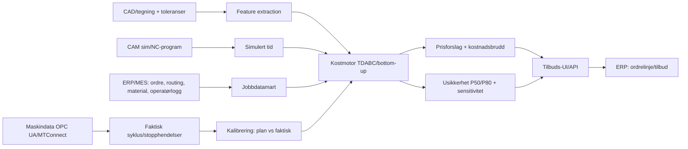
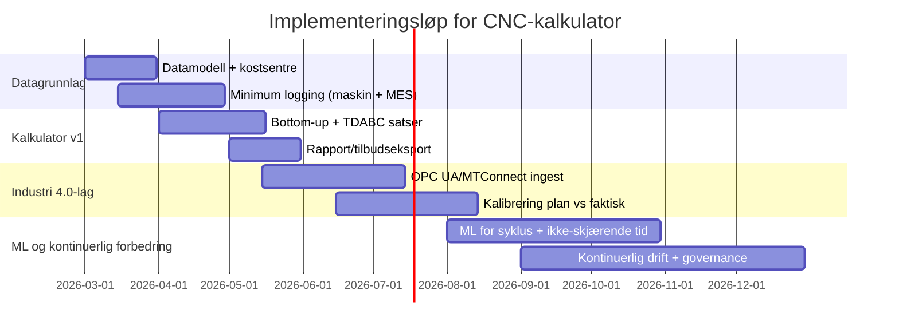

# Industri 4.0-baserte beregningsmodeller for prising av CNC-operasjoner

## Executive summary
Industri 4.0-miljøer bygger i praksis CNC-prising på en hybrid av (a) **bottom‑up prosesskost** (setup + programmering + syklustid + etterarbeid + QC) og (b) **datadrevet kalibrering** der digitale tvillinger og sensordata kontinuerlig korrigerer timeestimatene og kapasitetsutnyttelsen. citeturn24search0turn24search16turn24search2turn24search11turn23search11turn23search4  
De mest robuste modellene bruker en **Time‑Driven Activity‑Based Costing (TDABC)**-tankegang: man beregner *kapasitetskost per time* for hver ressurs (maskin, operatør, QC, programmering), og ganger med målte/estimerte tidsdrivere for jobben. citeturn23search7turn23search18turn23search11  
Digital tvilling (rammeverk standardisert i ISO 23247-serien) og standardiserte datagrensesnitt (OPC UA og MTConnect) gjør at syklustid, stopp, alarmer, feed‑override, energiforbruk m.m. kan logges automatisk og brukes til både kalkulasjon og læring. citeturn24search0turn24search16turn24search2turn24search11turn25search1  
Maskinlæring brukes mest effektivt til (1) **syklustidsestimat** fra NC‑program/ CAM‑sim og (2) **ikke‑skjærende tid** (oppspenning, manuell håndtering, verktøyskift, måling, rework) som tradisjonelt har høy variasjon og lav transparens. citeturn23search2turn23search6turn23search17turn23search1turn23search16  
For Norge er offentlige og leverandørpubliserte timepriser for *høypresisjons CNC i Olje & Gass og Forsvar* ofte lite transparente (ofte konfidensielt i tilbud). Likevel viser åpne kilder at verksted-/mekanisk arbeid i Norge kan ligge rundt **~976–980 kr/time eks. mva** i enkelte prislister, mens segmenter med streng dokumentasjon/sertifisering (AQAP/NATO‑krav, NORSOK-regime, sporbarhet) typisk gir premie via økt QA‑tid og indirekte kost. citeturn53view0turn53view1turn53view2turn47search0turn47search1turn47search9  

## Industri 4.0-prinsipper som påvirker prising av CNC
**Digital tvilling som “planlagt vs. faktisk”-motor.** ISO 23247 beskriver en digital tvilling-ramme for produksjon som kobler digitale modeller med fysisk tilstand, og er laget for å kunne spesialiseres til ulike produksjonstyper. citeturn24search0turn24search16  
I prising brukes dette til å:
- holde en *maskinspesifikk* syklustidsmodell (inkl. akselerasjon, kontrollerbegrensninger, verktøyskift, palettlogikk), og  
- sammenligne *CAM/NC-simulert tid* mot *målt maskintid* og lære korrigeringsfaktorer per maskin, materiale og strategi. citeturn23search16turn23search6turn23search1  

image_group{"layout":"carousel","aspect_ratio":"16:9","query":["5-axis CNC machining center","CNC turning center machine tool","digital twin manufacturing dashboard"],"num_per_query":1}

**Sensor-/maskindata som sannhetskilde for tid og kapasitetsfaktorer.** Industri 4.0-prising forutsetter at “tidsdriverne” ikke bare er manuelle anslag. Standardiserte grensesnitt brukes for å hente maskindata:  
- entity["organization","OPC Foundation","opc ua standard body"] beskriver OPC UA som en internasjonal standard (IEC 62541) for vertikal og horisontal kommunikasjon og semantisk interoperabilitet i industri/automatisering. citeturn24search2  
- entity["organization","MTConnect Institute","machine tool data standard"]/MTConnect beskrives som en lettvekts, åpen protokoll for å hente data fra NC-maskiner til overvåkning/analyse (read‑only, XML over HTTP). citeturn24search11  

**Automatisert tidsmåling og hendelsesmodell.** I en Industri 4.0-kontekst blir “setup” og “syklustid” ofte delt i flere hendelser (setup-start, program-last, dry‑run, førsteartikkel, serieproduksjon, stoppårsaker), slik at man kan prise og forbedre riktig del av prosessen. Dette er en forutsetning for å få TDABC-lignende modeller til å fungere uten tunge manuelle tidsstudier. citeturn23search7turn23search18turn24search2turn24search11  

**Maskinlæring som forbedringslag, ikke eneste modell.** Forskning viser flere praktiske tilnærminger:  
- Estimering av syklustid fra NC-program med dyp læring (f.eks. å behandle NC-program som “språk” og bruke sekvensmodeller). citeturn23search2  
- Modeller som predikerer faktisk kjøretid der CAM/NC-kommandoer avviker fra observerte feed-profiler i maskinen. citeturn23search6  
- Forklarbar AI som knytter CAD‑geometri/“features” til kostnad og synliggjør hva som driver prisen. citeturn23search17  

**Energi som kost- og bærekraftdriver.** entity["organization","National Institute of Standards and Technology (NIST)","us standards institute"] har publisert arbeid på datadrevne energimodeller for maskinverktøy og metodikk for innsamling/bruk av energidata i prediksjon. citeturn25search1  
I tillegg adresserer entity["organization","International Organization for Standardization (ISO)","standards body"] ISO 14955‑serien energi/ miljøevaluering for maskinverktøy (bl.a. prosess og prinsipper for energieffektivitet). citeturn25search0turn25search11  

## Inputparametere og datamodell for kalkulatoren
En Industri 4.0-kalkulator skiller typisk mellom **(A) deldata**, **(B) operasjonsdata**, **(C) ressurs-/kostsenterdata** og **(D) risiko/krav**. Dette gjør at samme del kan prises på ulike maskiner/strategier, og at læring kan skje per dimensjon.

### Foreslått parameterstruktur
| Gruppe | Parametere (eksempler) | Typisk kilde i Industri 4.0-oppsett |
|---|---|---|
| Materiale | legering/standard, hardhet, densitet, råemneform og -pris, bearbeidbarhetsfaktor | ERP/innkjøp, materialdatabase, historikk |
| Geometri/feature | bounding box, netto/ brutto volum, fjernet volum, antall oppspenninger, tilgangsvinkler (5-akse), hull/plan/lommer, overflateareal | CAD/STEP, feature extraction, CAM |
| Maskin-/prosessvalg | dreiing/fresing, 3‑akse/4‑akse/5‑akse, turn‑mill, arbeidsrom, palett/robot, målesystem | maskinregister, MES, digital tvilling |
| Verktøy og forbruk | verktøytype, skjærehastighet/mating, verktøylevetid, antall verktøyskift, kjølevæske, spenntang/jigger | CAM, verktøydatabase, sensordata/tool‑life |
| Tider | oppspenningstid, programmeringstid, syklustid, håndtering, etterarbeid (deburr), varmebehandling, overflate, QC-tid, pakking | CAM sim + maskindata (OPC UA/MTConnect) + MES |
| Kvalitet/toleranser | toleranseklasse, overflatekrav, måleplan (CMM/3D scanning), dokumentasjon/sporbarhet, førsteartikkel | QMS, kundekrav, standardkrav |
| Batch/ordre | batchstørrelse, leveringshast, serieprofil, læringsfaktor, omstillingsfrekvens | ERP/MES, salgsdata |
| Økonomi/kapasitet | vedlikehold, avskrivning, energipris, OEE/utnyttelse, operatørkost, indirekte kost | regnskap, MES, energi-/sensordata |
| Risiko | sannsynlig skrap/rework, kollisjonsrisiko, materialrisiko, kapasitetspress, endringsrisiko i tegning | historikk, ML risikomodell, regler |

Denne typen struktur samsvarer med forskning og praksis der CNC-kost er sum av aktivitetene (maskinoperasjon, setup, verktøy, material, overhead) og der feature-/prosessdata brukes til å estimere tidsdrivere. citeturn23search11turn23search1turn23search4  

**Viktig for 5‑akse og multi‑akse:** Tidsprediksjon er mer sensitiv for kinematikk, simultan-akser, feedbegrensninger og kontrollerens interne planlegging; derfor er “simulert tid” ofte systematisk biased uten kalibrering. citeturn23search16turn23search6  

## Kostnadsmodeller og estimatorer brukt i Industri 4.0-miljøer
I praksis ender mange virksomheter med en **hybrid** fordi én modell alene ikke gir både hastighet (tilbud på minutter), forklarbarhet (hvorfor prisen ble slik) og nøyaktighet (for 5‑akse/høy presisjon).

### Bottom‑up prosesskost som grunnmodell
Kjernen er å regne aktivitet for aktivitet:
- Setup/omstilling (oppspenning, nullpunkt, verktøy, prøvekjøring)  
- Programmering (CAM/NC, simulering, postprosess, dokumentasjon)  
- Maskintid (skjæring + ikke-skjærende bevegelse + verktøyskift)  
- Etterarbeid (deburr, vask, merking, varme/overflate, montering)  
- Kvalitetskontroll (måling, rapport, førsteartikkel, sporbarhet)

Denne tilnærmingen er godt dokumentert i CNC-kostlitteratur (aktivitetsbasert/feature-basert), der total kost er summen av aktivitetene og deres kostdrivere. citeturn23search11turn23search4turn23search15  

### TDABC som “motor” for satser og kapasitet
TDABC (Kaplan & Anderson) brukes ofte implisitt i Industri 4.0-prising: man beregner **kapasitetskost per time** (eller minutt) for hver ressurs og multipliserer med tidsforbruk per aktivitet, basert på praktisk kapasitet. citeturn23search7turn23search18  
Dette passer spesielt godt når sensordata gjør at tid per aktivitet kan estimeres automatisk og oppdateres kontinuerlig. citeturn24search2turn24search11  

### Parametriske modeller for rask tilbudsgivning
Parametriske/feature-baserte modeller gir raske estimater (ofte før full prosessplan er klar). Et eksempel er feature-baserte metoder for NC-maskineringstid som er ment å være “real-time” nyttige. citeturn23search1  
Typisk form:
- \(t_{cycle} \approx \alpha\cdot V_{fjernet} + \beta\cdot A_{overflate} + \gamma\cdot n_{features} + \delta\cdot f(materiale)\)  
- Setup og programmering som funksjon av antall oppspenninger, toleranseklasse og 5‑akse kompleksitet.

### Læringsbaserte estimater og prediksjon av faktisk syklustid
Industri 4.0-miljøer bruker ML der datagrunnlaget er godt:  
- Sekvensmodeller for syklustid fra NC-program. citeturn23search2  
- Nevralnett for å predikere faktisk kjøretid fra komplekse 3‑akse programmer når faktisk feedprofil avviker fra kommandert. citeturn23search6  
- XAI/feature-visualisering for kostprediksjon fra CAD-modeller. citeturn23search17  

**Praktisk anbefaling:** Bruk ML som et *kalibrerings- og forslagssystem* (P50/P80) oppå en forklarbar bottom‑up/TDABC‑kjerne, slik at kalkulatoren kan begrunnes overfor kunde og internt, samtidig som den blir bedre med data. citeturn23search7turn23search11turn23search2  

## Datakilder, datainnsamling og kvalitetssikring
### Datakilder som typisk inngår
**Maskin- og sensordata** hentes via standardiserte grensesnitt (OPC UA/MTConnect) for status, syklusstart/slutt, stopp, alarmer, override, tellerverk, og i noen oppsett energidata. citeturn24search2turn24search11turn25search1  

**ERP/MES** gir ordrelinjer, routing, planlagt vs faktisk tid, skiftplaner, materialkost, og ofte operatørregistrering for setup/QC/etterarbeid. En vanlig referanseramme for integrasjon mellom enterprise- og produksjonslag er ANSI/ISA‑95 (IEC 62264), som eksplisitt har som mål å definere grensesnitt mellom foretakssystemer og produksjonskontroll. citeturn48search0  

**Historiske jobber** (tilbudsdata + faktisk) er den viktigste kilden for kalibrering:
- “Estimert tid” (tilbud)  
- “Planlagt tid” (CAM sim / routing)  
- “Faktisk tid” (maskinlogg + operatørlogg)  
- Skrap/rework og QC-utfall.

**Benchmarking** skjer ofte indirekte (tapte/vunne jobber, kundens target) fordi reelle konkurrenttimepriser sjelden er offentlig tilgjengelig i høypresisjonssegmentet.

### Innsamling
Et Industri 4.0-oppsett som faktisk fungerer for prising krever en **hendelsesmodell** (event log) som kan rekonstruere jobbkost per operasjon. Minimum:
- maskin-eventer (cycle_start, cycle_end, idle_reason)  
- operatør-eventer (setup_start/end, QC_start/end, rework_start/end)  
- kobling til ordre/operasjon/NC-programversjon.

OPC UA og MTConnect brukes nettopp for å få strukturerte og standardiserte data fremfor proprietære formater. citeturn24search2turn24search11  

### Validering og datakvalitet
Robuste miljøer gjør eksplisitt:
- **Versjonskontroll** (hvilken tegning, NC, fixture og verktøyliste ga hvilken tid/kost).  
- **Avvikshåndtering** (høy feed override, uplanlagte stopp, førsteartikkel).  
- **Kalibrering**: modellfeil per maskin/materiale og “størrelsesklasse” (små detaljer vs store flater). citeturn23search6turn23search16turn23search1  

## Kalkulasjonsarkitektur med formelsett, usikkerhet og UI/IO
### Kjerneidé: ressurs-satser × tidsdrivere + direkte kost
Bruk TDABC-prinsippet for satser (kapasitetskostrate) og bottom‑up for tidsdrivere. citeturn23search7turn23search11  

#### Variabler (foreslått)
**Ordre/del**
- \(N\) = batchstørrelse  
- \(s\) = skraprate (andel)  
- \(r\) = rework-rate (andel)  
- \(C_{mat}\) = materialkost (råemne + svinn)  

**Tider (timer)**
- \(t_{prog}\) = programmering (CAM/NC, simulering, dok)  
- \(t_{setup}\) = oppspenning/omstilling  
- \(t_{cycle}\) = syklustid per del (maskin)  
- \(t_{hand}\) = manuell håndtering per del (lasting, merking, vask)  
- \(t_{post}\) = etterarbeid per del (deburr osv.)  
- \(t_{qc}\) = kvalitetskontroll per del (+ førsteartikkel)  

**Satser (NOK/time)**
- \(R_{m}\) = maskinsats (per maskin eller celle)  
- \(R_{op}\) = operatørsats  
- \(R_{qc}\) = QC/CMM-sats  
- \(R_{eng}\) = programmerings-/ingeniørsats  

**Andre kost**
- \(C_{tool}\) = verktøykost per batch (slitasje, spesialverktøy)  
- \(C_{ext}\) = eksterne prosesser (HT, NDT, coating)  

#### Maskinsats per maskin (internkost)
Definer *praktisk kapasitet* og del årlige/ faste kost på den. Dette er i tråd med TDABC-logikken om praktisk kapasitet og kapasitetskostrate. citeturn23search7turn23search18  

- \(H_{pr}\) = praktiske maskintimer/år (planlagt tid × tilgjengelighet × realistisk utnyttelse)  
- \(A_{fixed}\) = årlige faste kost (avskrivning/finans, serviceavtale, vedlikehold, areal, IT/lisenser, indirekte)  
- \(v_{energy}\) = energi per time (målt eller modellert; NIST har vist datadrevne tilnærminger for energiprediksjon fra maskin- og sensordata) citeturn25search1  

Da:
- \(R_m = A_{fixed}/H_{pr} + v_{energy} + v_{cons}\)

#### Total kost per batch og stykk
Batchkost:
\[
C_{batch} =
R_{eng}\cdot t_{prog} +
R_{m}\cdot t_{setup} +
R_{op}\cdot t_{setup} +
N\cdot (R_{m}\cdot t_{cycle} + R_{op}\cdot t_{hand} + R_{op}\cdot t_{post} + R_{qc}\cdot t_{qc})
+ C_{tool}+C_{mat}+C_{ext}
\]

Skrap/rework kan legges inn som:
- effektivt antall deler \(N_{eff} = N\cdot (1 - s)\)  
- rework-tid \(t_{re} = r\cdot t_{cycle}\cdot k\) (k = rework‑faktor)  

Stykkkost:
\[
C_{stk} = C_{batch}/N_{eff}
\]

#### Påslag og prising
Pris settes ofte som:
- \(P_{stk} = C_{stk}\cdot(1+m) + \text{risikotillegg}\)  
der \(m\) er målmargin.

### Usikkerhetsanalyse (anbefalt)
Industri 4.0-prising gjør det mulig å anslå **P50/P80** i stedet for kun et punktestimat:
- Bruk triangulære eller lognormale fordelinger for \(t_{setup}, t_{cycle}, t_{qc}\) basert på historiske avvik per maskin/materiale.  
- Kjør Monte Carlo for å få fordeling på \(C_{stk}\).  
- Siter resultat som P50 (most likely) og P80 (konservativt) og la kommersiell policy velge prisnivå.

Dette er spesielt viktig ved 5‑akse/høypresisjon, der faktisk kjøretid og risiko for rework kan avvike systematisk fra plan. citeturn23search16turn23search6turn23search2  

### Foreslått systemarkitektur

### UI/IO for en kalkulator
**Input (UI/API)**
- Del: materiale, råemne, CAD/STEP, toleranse/overflate, krav til dokumentasjon.  
- Prosess: velg operasjoner (dreiing/fresing/5‑akse), maskinvalg eller “auto‑valg”.  
- Batch: \(N\), leveringsdato, prioritet.  
- Overstyringer: “låst” setup‑tid, “låst” syklustid, spesial‑QC, risiko.  

**Output**
- Kostnadsbrudd (programmering, setup, maskintid, operatør, verktøy, QC, etterarbeid, material, ekstern).  
- Prisforslag P50/P80, inkl. anbefalt risikotillegg.  
- Sensitivitet: hvilke parametere driver kost mest.  
- “Hva må forbedres for å nå target?” (digital tvilling/ML-innsikt).

**Implementeringstidslinje (foreslått)**

## Norske prisnivåer, timepriser og kontraktsmodeller i Olje & Gass og Forsvar
### Vi har funnet åpne, norske prispeiler – men begrenset transparens for høypresisjons CNC
I høypresisjonssegmentet er konkrete timepriser ofte del av tilbud (konfidensielt), og publiseres sjelden som prislister. Åpne kilder kan likevel gi “gulv” og indikasjoner.

**Eksempel på offentlig prisliste (Norge):** Prisliste 2024 fra entity["company","Selfa","marine service trondheim norway"] viser timepriser for arbeid i størrelsesorden **~976–980 kr/time eks. mva** for flere fagkategorier (bl.a. mekanisk/sveis, plastarbeid, elektrisk), og høyere for konsulent (1 424 kr/time eks. mva). citeturn53view0turn53view1  
Dette er ikke “CNC‑spesifikk høypresisjon” i Olje & Gass/Forsvar, men gir et åpent datapunkt for norsk verkstedtime i et industrielt tjenestemiljø.

### Kontraktsmodeller i offentlig sektor som påvirker timeprislogikk
Offentlige rammeavtaler bruker ofte **prisskjema** med enhetspriser og/eller timesatser. Et konkret eksempel fra entity["organization","Forsvarsbygg","norwegian defence estates agency"] viser at oppdragsgiver endrer krav slik at **timepriser “i liten grad benyttes”** og kun brukes der prisskjema ikke har dekkende enhetspris. citeturn53view3  
Dette illustrerer en viktig mekanisme for deres kalkulator: vedlikehold/servicemarkedet kan prises med enhetspriser + time som “fallback”, mens produksjonsjobber ofte prises per del/batch.

Et annet eksempel på rammeavtalelogikk er en mekanisk tjenesteanskaffelse via entity["organization","Oslo kommune","municipality oslo norway"] (v/ Vann- og avløpsetaten) med estimert verdi og pris som tildelingskriterium, samt dokumentstruktur med prisskjema og sikkerhetsvedlegg. citeturn18view0  

### Premiumdrivere i Forsvar
Forsvarsleveranser har ofte eksplisitte kvalitetssystemkrav. entity["company","Kongsberg Defence & Aerospace","defence contractor norway"] lister AQAP-standarder (f.eks. AQAP‑2110/AQAP‑2310) som relevante når leveranser er underlagt NATO-kvalitetskrav. citeturn47search9  
Et konkret norsk bevis på praksis er et dokument der entity["organization","Forsvarsmateriell","norwegian defence materiel agency"] godkjenner en leverandørs kvalitetssystem i henhold til **AQAP 2110** for en tidsperiode. citeturn53view2  
Dette påvirker prising ved at:
- QC/inspeksjon, dokumentasjon, sporbarhet og revisjonsberedskap gir mer tid per batch (og indirekte kost).  
- Risiko (skrap/rework) blir dyrere når dokumentasjonskrav forsterkes.

entity["company","DNV","classification society norway"] beskriver at AQAP-standardene er NATO-standarder som etablerer krav for forsvarskvalitetssikring i leverandørkjeder. citeturn47search5  

### Premiumdrivere i Olje & Gass på norsk sokkel
entity["organization","Standard Norge","standards body norway"] beskriver at NORSOK-standarder utvikles av norsk petroleumsindustri og at anerkjente standarder (NORSOK og ISO) utgjør et viktig grunnlag for regelverket på norsk sokkel. citeturn47search3turn47search0  
Videre brukes leverandørkvalifisering som risikostyring i forsyningskjeden; Achilles JQS beskrives som et pre‑kvalifiserings-/leverandørregister brukt av kjøpere i norsk/dansk Olje & Gass for å håndtere leverandørinformasjon og risiko. citeturn47search1  

**Prisimplikasjon:** NORSOK-/kvalifiseringsregimer påvirker kost via (a) strengere prosess- og inspeksjonskrav, (b) dokumentasjon, (c) krav til sporbarhet/materialsertifikater, og (d) ofte lavere fleksibilitet (mer “overhead per jobb”). citeturn47search0turn47search1  

## Case-beregninger og anbefalt prisingspraksis
### Hvordan definere timepris per CNC-maskin
**Fordeler**
- Gir et konsistent “språk” internt for kapasitetskost, sammenligning av jobber og prioritering.  
- Passer godt med TDABC: maskin er et kostsenter med praktisk kapasitet og kapasitetskostrate. citeturn23search7turn23search18  
- Sensor-/maskindata kan oppdatere utnyttelsesgrad og faktisk syklustid løpende (Industri 4.0). citeturn24search2turn24search11  

**Ulemper**
- Kan skjule at “operatørintensitet” varierer (robotcelle vs manuell).  
- Risiko for feilprising hvis timeprisen “bærer” for mye indirekte på jobber med atypisk setup/QC (typisk prototyper og høypresisjon).  
- I kunderelasjon er “timepris” ofte mindre relevant enn stykkpris/leveranseverdi.

**Anbefaling (praktisk)**
- Definer to satser:
  1) **Maskinsats \(R_m\)** (ressurskost for maskin/celle uten direkte operatør)  
  2) **Arbeidssats \(R_{op}\)** (operatør) + egne satser for \(R_{qc}\) og \(R_{eng}\)  
- La kalkulatoren alltid produsere **stykkpris per del/batch**, men med transparens tilbake til “maskintimer × sats”.  
- Bruk **minstebeløp** eller eksplisitt “setup + programmering”-linje for engangsjobber.

### Alternative prisingsenheter
- **Per del (stykkpris):** best for produksjonskontrakter; krever god modell for amortisering av setup/programmering.  
- **Per syklus/spindeltime:** nyttig internt for effektivitet, mindre egnet kommersielt alene.  
- **Per verdi/risiko (value-based):** aktuelt for forsvar/Olje & Gass når toleranser, sporbarhet og tidskritikalitet skaper høy verdi; krever moden kommersiell policy og dokumentert leveranserisiko.

### Eksempel: foreslåtte satser per maskinklasse (for kalkulatorens “default”, skal kalibreres)
**Merk:** Tallene under er *illustrative* og må erstattes av deres egne \(A_{fixed}, H_{pr}\), energidata og lønn/overhead. Åpne norske datapunkter for verkstedtime finnes, men er ikke direkte “CNC høypresisjon”. citeturn53view0turn53view1  

| Ressurs | Symbol | Eksempel sats (NOK/h) | Kommentar |
|---|---:|---:|---|
| 2‑akse CNC-dreiebenk | \(R_m\) | 1 150 | Kapitalkost moderat |
| 3‑akse VMC | \(R_m\) | 1 300 | Typisk “allround” |
| 5‑akse maskineringssenter | \(R_m\) | 1 850 | Høy CAPEX + risiko + ofte mer QA |
| Operatør (maskin) | \(R_{op}\) | 750 | Skift-/kompetanseavhengig |
| Programmering/CAM | \(R_{eng}\) | 900 | Inkl. indirekte ingeniørkost |
| QC/CMM | \(R_{qc}\) | 950 | Måleutstyr + kompetanse |

### Case A: Enkeltstykke, høypresis 5‑akse fres
**Scenario**
- \(N=1\), material: høylegert (vanskelig bearbeiding), stram toleranse  
- Operasjoner: 5‑akse fres + omfattende QC

**Tids- og kostmodell (eksempel)**
| Kostelement | Tid / mengde | Sats | Kost (NOK) |
|---|---:|---:|---:|
| Programmering/CAM | 6,0 h | 900 | 5 400 |
| Setup/opp-spenning (maskin) | 2,0 h | 1 850 | 3 700 |
| Setup/opp-spenning (operatør) | 2,0 h | 750 | 1 500 |
| Maskintid syklus | 1,2 h | 1 850 | 2 220 |
| Operatør under kjøring/håndtering | 0,8 h | 750 | 600 |
| Etterarbeid (deburr/vask) | 0,5 h | 750 | 375 |
| QC (førsteartikkel + rapport) | 1,5 h | 950 | 1 425 |
| Verktøyslitasje/spesial | – | – | 1 200 |
| Material + svinn | – | – | 1 800 |
| **Sum internkost** |  |  | **18 220** |

**Risikotillegg og margin (eksempel)**
- Skraprisiko 10% ⇒ kost / (1–0,10) ≈ 20 244  
- + 20% margin ⇒ **24 300 NOK** (avrundet stykkpris)

### Case B: Liten serie, turn‑mill / 3‑akse + dreiing
**Scenario**
- \(N=20\), moderat toleranse, kombinerte operasjoner (dreiing + fresing)

| Kostelement | Tid / mengde | Sats | Kost (NOK) |
|---|---:|---:|---:|
| Programmering/CAM | 4,0 h | 900 | 3 600 |
| Setup (maskin/celle) | 2,5 h | 1 300 | 3 250 |
| Setup (operatør) | 2,5 h | 750 | 1 875 |
| Syklustid per del | 0,35 h × 20 | 1 300 | 9 100 |
| Operatør/håndtering per del | 0,10 h × 20 | 750 | 1 500 |
| Etterarbeid per del | 0,05 h × 20 | 750 | 750 |
| QC (stikkprøver + sluttkontroll) | 0,20 h × 20 | 950 | 3 800 |
| Verktøy | – | – | 1 000 |
| Material | – | – | 4 000 |
| **Sum internkost** |  |  | **28 875** |

Stykkkost: 28 875 / 20 = **1 444 NOK/stk**  
Legg på (eksempel) 15% margin ⇒ **1 660 NOK/stk** (tilbud), batch ≈ **33 200 NOK**.

### Case C: Stor serie, 3‑akse med palett/automatisering
**Scenario**
- \(N=500\), god repeterbarhet, lav toleransekompleksitet, høy utnyttelse

| Kostelement | Tid / mengde | Sats | Kost (NOK) |
|---|---:|---:|---:|
| Programmering/CAM | 10,0 h | 900 | 9 000 |
| Setup (maskin) | 4,0 h | 1 300 | 5 200 |
| Setup (operatør) | 4,0 h | 750 | 3 000 |
| Syklustid per del | 0,08 h × 500 | 1 300 | 52 000 |
| Operatør/håndtering per del | 0,02 h × 500 | 750 | 7 500 |
| QC (SPC/utvalg) | 0,01 h × 500 | 950 | 4 750 |
| Verktøy/forbruk | – | – | 6 000 |
| Material | – | – | 25 000 |
| **Sum internkost** |  |  | **112 450** |

Stykkkost: 112 450 / 500 = **225 NOK/stk**  
+ 12% margin ⇒ **252 NOK/stk** (tilbud), batch ≈ **126 000 NOK**.

### Videre validering og implementering
**Kilder som bør prioriteres i implementeringen**
- ISO 23247 (digital tvilling rammeverk) og NIST sin analyse/fortolkning av serien. citeturn24search0turn24search16  
- OPC UA/IEC 62541 (semantisk interoperabilitet) og MTConnect for maskindata. citeturn24search2turn24search11  
- ANSI/ISA‑95 / IEC 62264 for ERP–MES integrasjon. citeturn48search0  
- Forskning på tidsestimat i 3‑akse/5‑akse og feature-baserte metoder. citeturn23search1turn23search16turn23search6  
- Norsk kontekst: NORSOK-regimet (Standard Norge) og defense quality (AQAP) nivå/krav. citeturn47search0turn47search9turn53view2  

**Praktiske valideringssteg (anbefalt)**
- Kjør “shadow quoting”: kalkulatoren regner parallelt med dagens metode i 50–200 jobber.  
- Mål tre viktige avvik: \(\Delta t_{setup}\), \(\Delta t_{cycle}\), \(\Delta t_{qc}\) per maskin/materiale.  
- Etabler governance: hvem kan overstyre satser, og hvordan overrides logges (slik at ML ikke lærer feil).  
- For forsvar/Olje & Gass: modeller QA-tid eksplisitt (dokumentpakker, sporbarhet, førsteartikkel), og knytt det til toleranse/sertifiseringsnivå i input.

**Merknad om norske markedspriser (status i åpne kilder)**  
Åpne og maskinspesifikke timepriser for *høypresisjons CNC i Olje & Gass og Forsvar* er ofte ikke publisert. De kildene som er lett tilgjengelige er enten generelle verkstedpriser (eksempel over) eller anskaffelsesdokumenter som beskriver prismekanismer uten å publisere leverandørenes priser. citeturn53view0turn53view3