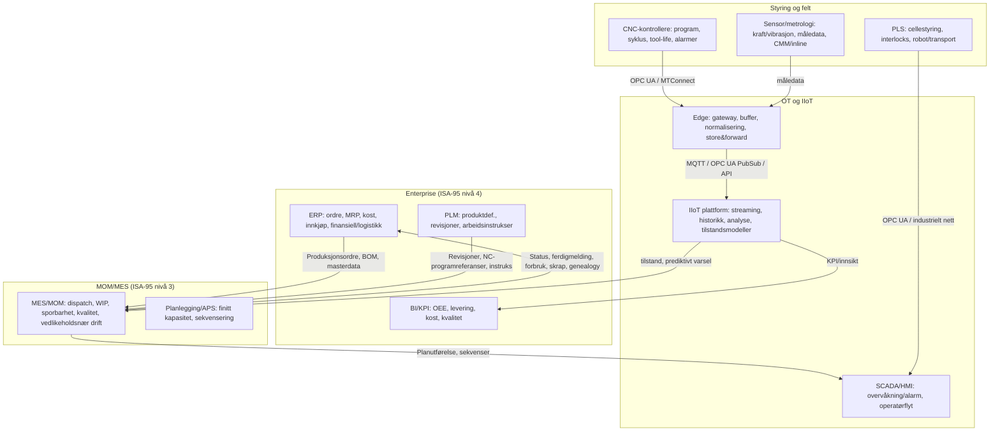

# ERP‑krav for CNC Smart Factory i Industry 4.0: hvordan Siemens og Fraunhofer (og ledende økosystemer) rammer inn behov, dataflyt og vertikal integrasjon

## Executive summary

Denne rapporten sammenstiller hvordan ledende Industry 4.0‑aktører beskriver krav og avgrensninger for ERP i en CNC‑dominert Smart Factory med full automasjonsstack (CNC‑kontrollere/PLS, SCADA/HMI, MES/MOM, IIoT/edge/cloud), og om **vertikal integrasjon via proprietær programvarestack** beskrives som en vesentlig styrke for business og produktivitet.

Siemens beskriver ERP‑rollen eksplisitt i ISA‑95‑rammeverk (ERP som nivå 4, MES/MOM som nivå 3) og fremhever systematisk at **ERP ↔ MES‑integrasjon** er kritisk for produktivitet, leveringspresisjon og datakonsistens. Siemens konkretiserer både **tids‑horisonter** (ERP “timer til år”, MES “sekunder til skift”) og typiske **dataobjekter** (ERP → MES: masterdata, BOM, endringsordrer; MES → ERP: materialforbruk, skrap, ferdigmelding, flaskehalser til finans/capex). citeturn16view1turn15view1

Når det gjelder vertikal integrasjon, posisjonerer Siemens den som en sentral styrke: de beskriver “vertikal integrasjon” som nødvendig for sømløs arbeids‑ og materialflyt mellom maskiner og høyere nivå (MES/ERP). citeturn11view2 De argumenterer videre for at en integrert portefølje kan gi én konsistent “database/data backbone” og at endringer blir umiddelbart synlige på tvers av prosessdeltakere, med målbare gevinster som fleksibilitet og kortere gjennomføringstid. citeturn11view3 I Siemens’ IIoT/“digital twin”‑fortelling fremheves en integrert livssyklusportefølje (PLM–MES/MOM–automasjon–IIoT) som grunnlag for produktivitets‑ og effektivitetsgevinster, og Siemens hevder eksplisitt et konkurransefortrinn i “closed‑loop innovation” gjennom komplette digitale tvillinger. citeturn11view4turn11view5

Fraunhofer‑miljøet (inkl. industrinære konsortier der Fraunhofer deltar) fremhever i større grad **interoperabilitet, standardisering og hybrid arkitektur** som nøkkel til skalering. Fraunhofer IPA beskriver “Asset Administration Shell (AAS)” som et hovedgrep for standardisert informasjonsutveksling og interoperabilitet i verdinettverk. citeturn18view0 Fraunhofer IESE peker på at Industry 4.0‑ambisjonen om å koble shopfloor til ERP/MES hindres av heterogene protokoller og manglende standardiserte grensesnitt, og at serviceorienterte konsepter (som Eclipse BaSyx) brukes for å redusere tid/innsats/budsjett. citeturn18view1 I en Fraunhofer‑ledet arkitekturstudie (batteriproduksjon, men direkte relevant som generell produksjons‑IT‑arkitektur) vurderes “single‑vendor”, “hybrid” og “best‑of‑breed”; konklusjonen er en **hybrid** kjerne med **ERP+MES+IIoT‑plattform** supplert med spesialiserte byggesteiner. citeturn7view0 I tillegg advarer Fraunhofer‑medforfattet Manufacturing‑X‑studie om at proprietære løsninger (f.eks. IIoT‑plattformer) ofte ikke skalerer, og at virksomhetsapplikasjoner bare skalerer robust når vendor lock‑in unngås og interoperabilitet faktisk er garantert. citeturn11view9

På tvers av globale Industry 4.0‑økosystemer og standarder er hovedmønsteret at ERP‑krav primært handler om **styring og integrasjon**, ikke realtids maskinstyring: ISA‑95 organiserer grensesnittet mellom enterprise‑logistikk og produksjonskontroll i lag og beskriver hvordan et foretak etablerer grensesnitt mellom dem. citeturn15view1 RAMI 4.0 og Industrial Internet Consortium understreker vertikal integrasjon (inkl. “fra produkter … til cloud”) samtidig som de vektlegger tjenesteorientert arkitektur og interoperabilitet som forutsetning for skalering. citeturn20view0turn11view12

Konklusjon på nøkkelspørsmålet: **Siemens beskriver vertikal integrasjon av (i praksis ofte proprietære) sammenhengende porteføljer som en tydelig styrke for business og produktivitet**, med argumenter om felles data, raskere gjennomføring og “closed‑loop” forbedringssløyfer. citeturn11view3turn11view5turn16view1 **Fraunhofer og nærliggende økosystemer beskriver derimot “tett vertikal integrasjon” som ønskelig på data‑ og prosessnivå, men anbefaler oftere standardbasert interoperabilitet og hybrid/best‑of‑breed for å redusere integrasjonskost, øke fleksibilitet og unngå lock‑in‑risiko.** citeturn11view9turn7view0turn18view0

## Avgrensning, metode og begreper

Fabrikkomfanget er avgrenset til **CNC‑bearbeiding** (maskineringsceller/linjer med CNC‑styrte maskinverktøy). Dette er støttet av standard‑ og økosystemkilder som eksplisitt retter seg mot maskinverktøy og CNC‑data (umati/OPC UA for Machine Tools, MTConnect). citeturn15view4turn15view5 Bruks‑/produksjonsprofil (high‑mix/low‑volume vs serieproduksjon, grad av robotisert materialhåndtering, regulatorisk regime, krav til sporbarhet) er **uspesifisert** av oppdragsgiver; der krav avhenger sterkt av dette, beskrives det som kontekstavhengig og dermed delvis uspesifisert.

Metoden er kildedrevet: primært Siemens‑materiale (whitepapers/brosjyrer og Opcenter‑dokumentasjon), Fraunhofer‑publikasjoner og prosjektsider, samt standard‑/konsortiekilder (ISA‑95/IEC 62264‑rammeverk, RAMI 4.0, OPC UA/Companion Specs, MQTT, MTConnect, IEC 62443, NIST OT‑sikkerhet). citeturn16view1turn15view1turn18view0turn15view4turn8search13turn15view5turn8search2turn15view8 “Andre globale Industry 4.0‑økosystemer” var **uspesifisert**; representativt er derfor brukt et utvalg som ofte fungerer som referanser i industrien: RAMI 4.0/Plattform I4.0, Industrial Internet Consortium, OPC Foundation/VDW/VDMA‑arbeid rundt maskinverktøy, samt NIST som OT‑sikkerhetsreferanse. citeturn20view0turn15view4turn15view8turn11view10

Begreper: “Vertikal integrasjon” brukes i tråd med Siemens’ definisjon der maskiner utveksler data med høyere nivå (MES/ERP). citeturn11view2 “Full automasjonsstack” forstås som et sammenhengende lag fra feltkontroll (CNC/PLS) til virksomhetsstyring (ERP) og analyse (edge/cloud). Dette samsvarer med ISA‑95‑lagtenkning og RAMI‑4.0‑hierarki/lagsmodell. citeturn15view1turn11view12

## Referansemodeller og standarder som former ERP‑krav i Industry 4.0

ISA‑95 (ANSI/ISA‑95 / IEC 62264) beskrives av entity["organization","International Society of Automation","isa standards body"] som et internasjonalt standardsett for integrasjon mellom logistikk/enterprise‑systemer og produksjonskontroll, organisert i lag og med retningslinjer for grensesnitt mellom lagene. citeturn15view1 Dette rammer typisk ERP som nivå 4 (business planning/logistics) og MES/MOM som nivå 3 (manufacturing operations). Siemens bruker eksplisitt ISA‑95 for å beskrive rollene og tids‑horisonter til ERP vs MES. citeturn16view1

B2MML fra entity["organization","MESA International","manufacturing standards org"] beskrives som en XML‑implementasjon av ISA‑95‑datamodellene (IEC/ISO 62264) og brukes ofte som strukturert datautvekslingsformat mellom ERP og MES‑domener (ordre, masterdata, resultater). citeturn15view2

RAMI 4.0 (DIN SPEC 91345‑familien, praktisert gjennom Plattform I4.0‑materiale) beskrives som et tredimensjonalt “kart” for Industry 4.0, og som en serviceorientert arkitektur som inkluderer både vertikal integrasjon og IT‑sikkerhet som del av løsningsrommet. citeturn11view12turn1view7 I en felles whitepaper fra entity["organization","Industrial Internet Consortium","iiot consortium"] og entity["organization","Plattform Industrie 4.0","german i4.0 initiative"] presiseres at RAMI 4.0 fremmer vertikal integrasjon “innen en fabrikk … fra produkter … til Cloud” og samtidig en SOA‑tilnærming. citeturn20view0

For CNC‑domener er standardisering av semantikk og kommunikasjon sentral. entity["organization","OPC Foundation","opc ua standards body"] beskriver umati‑arbeidet (med entity["organization","VDW","german machine tool assoc"]) som utvikling av en OPC UA informasjonsmodell for en universell kommunikasjonsflate fra maskinverktøy mot eksterne partnere som “MES, ERP, cloud, automation system”. citeturn15view4 entity["organization","VDMA","german mechanical eng assoc"] vektlegger at OPC UA muliggjør produsentuavhengig nettverking og at Companion Specifications standardiserer semantikk/vokabular, med konkrete use‑cases som condition monitoring og predictive maintenance. citeturn11view10

På protokollnivå knytter OPC UA også til pub/sub‑mønstre: OPC UA‑spesifikasjonen beskriver MQTT‑transport i PubSub‑modellen (publishers → broker → subscribers). citeturn9search1 MQTT er standardisert av entity["organization","OASIS","standards consortium"] (MQTT v3.1.1) som en lettvekts publish/subscribe‑protokoll egnet for M2M/IoT‑kontekster. citeturn8search13

For maskinverktøydata finnes også MTConnect: entity["organization","MTConnect Institute","mtconnect standards body"] beskriver MTConnect som et semantisk vokabular for fabrikkutstyr som gir strukturert, kontekstualisert data “med ingen proprietært format”, og med mål om reduserte oversettelseskostnader. citeturn15view5 “Getting Started”‑materiale beskriver i tillegg at protokollen bygger på HTTP og XML, og at standardisert data kan brukes av bl.a. ERP og MES‑applikasjoner. citeturn19view0

## Siemens: hvordan ERP‑krav rammes inn for en CNC Smart Factory

Siemens’ mest direkte “ERP‑kravbildet” er konsistent: ERP skal ikke forsøke å være realtids shopfloor‑styring, men skal eie enterprise‑logikk og integrere tett med MES/MOM (og ofte PLM) via ISA‑95‑lagdelingen. citeturn16view1turn15view1

### ERP‑rolle, tidshorisont og kjernefunksjoner

Siemens beskriver at ERP (nivå 4) styrer business‑logistikk og at ERP‑funksjonalitet ofte trigges av finansielle transaksjoner, med tidshorisont “timer til år”. citeturn16view1 I samme kilde listes ERP‑relevante produksjonsnære data/objekter som (eksempelvis) masterdata, BOM, SOP, change orders, inventory og production demand. citeturn16view1

Dette er direkte relevant for CNC‑fabrikker, hvor endringsstyrte rutinger (operasjonssekvenser), material‑ og verktøylogistikk og revisjonskontroll av produksjonsinstrukser ofte er flaskehalser for leveringspresisjon.

### Typiske ERP↔MES dataflyter Siemens fremhever

Siemens beskriver toveis flyt: ERP data “feeds downstream to MES”, og MES sender oppstrøms informasjon tilbake som input til ERP‑drevne businessbeslutninger. citeturn16view1 Siemens eksemplifiserer MES→ERP med material consumption, scrap og completion for kost og inventory, samt at flaskehalser kan rutes til finans for capex‑beslutninger. citeturn16view0turn16view1 Dette er særlig relevant for CNC‑domener der investering i ekstra spindelkapasitet, fixturer, automatisk verktøyskift, målesystemer eller robotisert håndtering ofte har stor økonomisk effekt.

### “Vertikal integrasjon” og integrert portefølje som produktivitetsdriver

Siemens definerer vertikal integrasjon eksplisitt som maskiner som utveksler data med “upper level monitoring and planning systems (MES/ERP systems)”, og slår fast at for sømløs arbeids‑ og materialflyt må både horisontal og vertikal integrasjon oppnås. citeturn11view2 Dette er en direkte påstand om at vertikal integrasjon er en forutsetning for produktivitet (gjennom sømløs flyt).

I en Siemens‑brosjyre om “Totally Integrated Automation” beskrives en plattform der PLM‑programvare og automasjon/engineering kombineres via en “shared database”, og at porteføljen “offers vertical integration through the Manufacturing Execution System (MES) … connection to the management level”. citeturn11view3 Samme materiale fremhever gevinsten som “Everyone … has access to the same consistent database … every change … immediately visible”, og kobler dette til fleksibilitet og kortere prosjektgjennomføring. citeturn3view1turn11view3 Dette er et tydelig eksempel på at Siemens beskriver en tettere, ofte proprietær‑orientert porteføljeintegrasjon som en business‑ og produktivitetsstyrke.

Siemens’ MindSphere‑whitepaper kobler dette videre til en integrert Digital Enterprise‑portefølje: den beskrives som en “comprehensive, integrated family … covers … value chain”, bygget på en felles plattform og “data backbone” som integrerer PLM, MES/MOM, automasjon (TIA) og MindSphere. citeturn11view4turn3view3 På “closed‑loop”‑nivå sier Siemens eksplisitt: “No other IoT provider can drive closed-loop innovation … like Siemens.” citeturn11view5 Uavhengig av om man aksepterer påstanden som markedsføring eller realitet, viser den tydelig at Siemens mener **vertikal/porteføljeintegrasjon er et kjerneargument for businessverdi**.

Siemens’ “Connectivity”‑whitepaper knytter dessuten vertikal integrasjon til prosess‑transparens, raskere respons på endringer og tilgang til kvalitetsdata/stock levels; samtidig diskuteres determinisme og redundans som grunnlag for høy tilgjengelighet i industrielle nett. citeturn2search12turn11view1

image_group{"layout":"carousel","aspect_ratio":"16:9","query":["Siemens Amberg Electronics Works digital factory","Siemens Totally Integrated Automation Digital Enterprise diagram","Siemens MindSphere IoT platform manufacturing","Siemens Opcenter MES ERP integration architecture"],"num_per_query":1}

## Fraunhofer og nærliggende økosystemer: ERP‑krav gjennom interoperabilitet, hybrid arkitektur og standarder

Fraunhofer‑miljøene opererer ofte som bro mellom industri og standardisering. I materialet som er mest relevant for ERP‑krav i en full automasjonsstack, vektlegges særlig (a) **interoperabilitet/standardiserte informasjonsmodeller**, og (b) **arkitekturvalg mellom single‑vendor, hybrid og best‑of‑breed**.

### Interoperabilitet og digitale tvillinger via AAS

Fraunhofer IPA (prosjektet InterOpera) beskriver at prosjektet fokuserer på praktisk implementering av en standardisert Asset Administration Shell (AAS), med mål om konkrete interoperable submodeller, open‑source‑løsninger og redusert integrasjonskost i verdinettverk. citeturn18view0 Dette impliserer et “ERP‑krav” på systemnivå: ERP må kunne inngå i et økosystem der ressurs‑ og prosessdata beskrives semantisk og utveksles standardisert, fremfor at ERP kun integreres punkt‑til‑punkt via proprietære adaptere.

Manufacturing‑X‑studien (med Fraunhofer som medforfatter sammen med bl.a. entity["organization","ZVEI","german electro industry assoc"] og VDMA) gjør dette mer eksplisitt: den peker på at proprietære plattformtilnærminger ofte ikke skalerer, og at applikasjoner bare kan skaleres robust når vendor lock‑in unngås og interoperabilitet faktisk er garantert. citeturn11view9 For ERP betyr dette i praksis et krav om **åpen integrasjon** (API‑er, standardiserte semantikker, datakontrakter) i stedet for leverandørspesifikke koblinger som binder fabrikkens utviklingstakt til ett økosystem.

### “Koble shopfloor til ERP/MES” som mål – men hemmet av heterogenitet

Fraunhofer‑publikasjonen om Eclipse BaSyx (Fraunhofer IESE) beskriver Industry 4.0 som en utvikling mot å koble shopfloor‑maskiner direkte til systemer i ulike lag i automasjonspyramiden (som ERP eller MES), men at dette er vanskelig i tradisjonelle produksjoner på grunn av manglende standardisering, heterogene protokoller og utilstrekkelige grensesnitt. citeturn18view1 Dette er en tydelig, forskningsforankret beskrivelse av hvorfor ERP‑krav i praksis må inkludere **integrerbarhet og standardstøtte**, ikke bare funksjonelle moduler.

### Arkitekturvalg: single‑vendor vs hybrid vs best‑of‑breed

I en åpen (CC‑lisensiert) arkitekturartikkel (Oberle mfl., med Fraunhofer‑tilknytning) beskrives tre implementasjonskonsepter: (1) single‑vendor der alle komponenter leveres av én leverandør; (2) hybrid der ERP, MES og IIoT‑plattform utgjør en stabil kjerne; og (3) best‑of‑breed med separate byggesteiner per funksjon. citeturn7view0 Artikkelen rapporterer at resultatet i casen er anbefaling av **hybrid IT‑landskap**, og at IEC 62264 (ISA‑95) gir et “solid foundation” for å identifisere funksjoner og krav. citeturn7view0

I en relatert Fraunhofer‑tekst om “Production Microservices” beskrives tradisjonell produksjons‑IT som sentraliserte, monolittiske suites med selvdefinerte (proprietære) grensesnitt, som gir høy integrasjonsinnsats og ofte hindrer helhetlig (nær) sanntidsintegrasjon. citeturn7view1 Dette materialet støtter en mer kritisk holdning til vertikal integrasjon som oppnås gjennom proprietær suite‑monolitt, og peker i retning av standardbasert, mer modulær integrasjon.

### Standardbasert kommunikasjon i maskin-/verkstedsindustrien

VDMA‑guiden (forberedt med vitenskapelig bidrag fra entity["organization","Fraunhofer IOSB-INA","industrial automation center"]) fremhever at OPC UA er etablert som en åpen, sikker og skalerbar kommunikasjonsarkitektur, og at semantikk standardiseres via Companion Specifications for å forenkle use‑cases som predictive maintenance. citeturn11view10 Dette er direkte relevant for CNC‑fabrikker hvor maskinverktøydata må normaliseres og forstås likt på tvers av OEM‑er og IT‑systemer.

## ERP‑krav for CNC Smart Factory med full automasjonsstack

Dette avsnittet syntetiserer kravbildet i de dimensjonene du etterspurte. Der krav er sterkt avhengig av (uspesifisert) produksjonsprofil, er det eksplisitt markert som kontekstavhengig.

### Referansearkitektur for dataflyt og integrasjon



Arkitekturen reflekterer ISA‑95‑lagdeling og Siemens’ beskrivelse av ERP↔MES‑dataflyt (ERP→MES input og MES→ERP feedback). citeturn15view1turn16view1 Den reflekterer også at CNC‑integrasjon i praksis må håndtere mange proprietære grensesnitt; forskning på CNC‑integrasjon peker på at hvert merke/modell ofte har “mostly proprietary” protokoller, og at standardiserende “high‑level communication” (som OPC UA) brukes for å lette integrasjon. citeturn17view0

### Dataflyter for CNC‑bearbeiding

For en CNC Smart Factory blir de viktigste enterprise↔shopfloor‑flytene typisk:

ERP→MES: produksjonsordre, routing/operasjonsplan, masterdata, BOM, endringsordrer, SOP/instrukser og etterspørselsdata. Dette samsvarer med Siemens’ liste over ERP‑produksjonsrelaterte dataobjekter og deres beskrivelse av at ERP gir input til MES. citeturn16view1

MES/IIoT→ERP: ferdigmelding, WIP‑status, faktisk forbruk, skrap, flaskehalser og kvalitet/ytelsesindikatorer som inngår i kost/inventory‑oppdateringer og investeringsbeslutninger. Siemens beskriver eksplisitt at MES kan dele forbruk/skrap/ferdigmelding for costing og inventory, og at flaskehalser kan sendes til finans for capex‑beslutninger. citeturn16view0turn16view1

CNC/OT→MES/IIoT: maskintilstand, syklustider, alarmer, programkontekst, tool‑life/wear‑indikatorer, samt prosessnære sensor‑ og metrologidata. Fra Fraunhofer‑maskinverktøyforskning er et viktig poeng at sensorikk integrert i maskinverktøy er nødvendig for adaptiv produksjon og for å gjøre prosess‑ og produktinformasjon tilgjengelig for styringssystemer. citeturn1view4 CNC‑integrasjonslitteratur om OPC UA peker på behovet for å samle og standardisere slikt utstyrsnært datagrunnlag. citeturn17view0

### Realtidskrav og latenskrav (funksjonelt og praktisk)

Et sentralt funn på tvers av Siemens/Fraunhofer/standarder er at “realtid” må deles i lag:

Kontrollrealtid (ms/µs): PLS og CNC styrer bevegelser/interlocks og krever determinisme. Siemens beskriver at automasjon krever mer deterministisk data og prioritet, og diskuterer høy tilgjengelighet og redundans i industrielle nett. citeturn11view1

Operasjonell “nær‑realtid” (sekunder til skift): MES må kunne orkestrere og justere produksjon “in real time” i driftens tidsrom; Siemens skriver at MES typisk opererer i tidsrammer fra “seconds to shifts”, mens ERP er sjeldnere enn en sanntids‑motor for shopfloor. citeturn16view1 Fraunhofer peker på at manglende integrasjon gir “delayed data” (i kontrast til “(Near) real-time data”) og gjør kortsiktig produksjonsstyring dyrere. citeturn7view1

Enterprise‑taktisk/strategisk (minutter til år): ERP driver planlegging, logistikk og økonomi over lengre horisonter. Dette er eksplisitt hos Siemens. citeturn16view1

Et praktisk ERP‑krav blir derfor sjelden “sub‑sekund determinisme”, men i stedet: (a) korrekt, rask og robust synkronisering av produksjonsstatus, (b) hendelsesdrevet “nær‑realtid” for beslutningsstøtte (f.eks. materialmangel, kvalitetsavvik, maskinnedetid), og (c) robust utholdenhet (buffer/store‑and‑forward) når OT‑nett eller cloud‑forbindelser svikter. Disse kravtypene er konsistente med NISTs understreking av at OT‑sikring må ta hensyn til unike ytelses‑ og pålitelighetskrav. citeturn15view8

### Sporbarhet, kvalitet og vedlikehold – CNC‑spesifikke implikasjoner

Sporbarhet: Siemens’ MES‑beskrivelse inkluderer “as-built genealogy yields” som en type informasjon MES håndterer i produksjonsnære prosesser. citeturn16view1 Fraunhofer‑tilknyttet arkitekturarbeid lister eksplisitt sporbarhetskrav i MES knyttet til standarder (f.eks. ISO 9000‑familien og bilindustri‑rammer), som illustrerer at sporbarhet ofte realiseres i MOM/MES men må kunne rulles opp til enterprise‑nivå. citeturn7view0 For ERP betyr dette at ERP må støtte enterprise‑sporbarhet (lot/serial, material‑ og prosessgenealogi) og kunne konsumere produksjonsgenealogi fra MES for compliance og kost. (Dette er en syntese basert på at Siemens beskriver MES→ERP‑feedback for costing/inventory og at MES bærer genealogy.) citeturn16view1

Kvalitet: Siemens fremhever at MES‑kapabiliteter inkluderer integrasjon av regulatoriske og kvalitetskrav. citeturn16view0turn16view1 VDMA legger vekt på at Companion Specifications standardiserer semantikk slik at use‑cases som condition monitoring og predictive maintenance blir enklere; tilsvarende gjelder for kvalitets‑ og prosessdata som skal sammenstilles på tvers av OEM‑er. citeturn11view10

Prediktivt vedlikehold: VDMA peker eksplisitt på predictive maintenance som et mål for standardisert datautveksling. citeturn11view10 Siemens’ “digital performance twin”‑fortelling er bygd rundt å bruke tilstands‑/ytelsesdata for innsikt og forbedring, og hevder businessverdi gjennom lukkede sløyfer. citeturn11view5 Fraunhofer‑maskinverktøyforskning peker samtidig på sensor‑ og databehandlingsbehov for å utlede praktisk tolkningsbar informasjon (som verktøyslitasje) under maskinering. citeturn1view4

### Cybersecurity‑krav i en vertikalt integrert fabrikk

Tre standardankre er spesielt relevante:

ISA/IEC 62443‑serien beskriver krav og prosesser for å etablere og vedlikeholde cybersikre industrielle automasjons‑ og kontrollsystemer, og presenteres som “best practices” og vurderingsgrunnlag for sikkerhetsnivå. citeturn8search2

NIST SP 800‑82r3 (“Guide to Operational Technology Security”) understreker at OT‑sikring må adressere ytelse, pålitelighet og sikkerhet, og gir topologier/trusler/mottiltak. citeturn15view8

OPC UA sin sikkerhetsmodell adresserer autentisering av klient/server og brukere, samt integritet og konfidensialitet i kommunikasjon, men peker på at konkrete sikkerhetsmekanismer må bestemmes i systemdesign og kan spesifiseres av andre standarder. citeturn15view9

ERP‑implikasjonen i en CNC Smart Factory er derfor at ERP må støtte (minst) sterk identitet/tilgangsstyring, revisjonsspor (audit logs), og sikre integrasjoner (API‑gateway, sertifikatstyring, segmentering) – men at den mest kritiske “hard real‑time sikkerheten” ligger i OT‑arkitekturen og mellomlagene.

### Standarder/protokoller: OPC UA, MTConnect, MQTT i ERP‑integrasjon

I CNC‑domener er det ofte nødvendig å standardisere både syntaks og semantikk for å unngå at ERP‑integrasjon blir et “adapterprosjekt” per maskin.

OPC UA + Companion Specs: umati‑initiativet beskrives som en universal maskinverktøy‑interface mot “MES, ERP, cloud…”. citeturn15view4 VDMA‑guiden beskriver OPC UA som produsentuavhengig og at Companion Specs standardiserer semantikk for tverrindustrielle use‑cases. citeturn11view10

MQTT: MQTT beskrives som en lettvekts pub/sub standard for IoT/M2M, og OPC UA PubSub støtter MQTT‑transportmønster med broker. citeturn8search13turn9search1 Et praktisk mønster i Industry 4.0 er at edge/IIoT publiserer til broker (MQTT), mens enterprise‑systemer (inkl. ERP via integrasjonslag) konsumerer hendelser.

MTConnect: MTConnect beskrives som et semantisk vokabular uten proprietært format som reduserer “translation costs”, og materialet beskriver at standardisert data kan brukes av ERP/MES‑systemer. citeturn15view5turn19view0

### Sammenligningstabell: anbefalte ERP‑funksjoner for CNC Smart Factory

Prioritetsskala: **Høy** = nødvendig for å drive fabrikk/økonomi med tett integrasjon; **Middels** = sterkt anbefalt i full automasjon; **Lav** = situasjonsavhengig/avhenger av (uspesifisert) produksjonsprofil og modenhet.

| Funksjon | Beskrivelse (ERP‑perspektiv) | Prioritet | Kilde (eksempler) |
|---|---|---|---|
| Produksjonsordre og enterprise‑planlegging | Opprette/endre produksjonsordre, etterspørsel → produksjonsplan; gi input til MES. | Høy | Siemens beskriver ERP→MES‑flyt og “production demand/master data/BOM/change orders”. citeturn16view1 |
| Masterdata (artikler, ressurser, struktur) | Sentral definisjon av produkt‑/ressurs‑masterdata som konsumeres av MES/APS. | Høy | Siemens’ ERP‑liste inkluderer master data og BOM/SOP. citeturn16view1 |
| BOM/rutinger og endringsstyring | BOM + endringsordrer må være revisjonsstyrt og synkronisert mot produksjon (via MES/PLM). | Høy | Siemens lister BOM og change orders som ERP‑innhold; Siemens portefølje argumenterer for konsistent database og umiddelbar synlighet av endringer. citeturn16view1turn11view3 |
| MRP / materialbehov og lager | Kalkulere behov og styre lager/innkjøp; få faktisk forbruk fra MES. | Høy | Siemens beskriver at MES deler material consumption til ERP for costing/inventory; og at ERP dekker purchasing/inventory. citeturn16view0turn16view1 |
| Innkjøp og leverandørstyring | Innkjøp av råvarer, skjæreverktøy og MRO; koble til materialforbruk og vedlikeholdsbehov. | Høy | ERP‑rollen “purchasing and inventory” hos Siemens. citeturn16view1 |
| Kost/controlling og finans | Integrere produksjonsutfall (forbruk, skrap, ferdig), støtte capex‑beslutninger basert på flaskehalser. | Høy | Siemens gir eksempler på flaskehals→finans og MES→ERP for costing. citeturn16view0turn16view1 |
| Integrasjons‑ og grensesnittstyring | Standardiserte dataobjekter/kontrakter (ISA‑95/B2MML), robuste API‑er og meldingsmønstre. | Høy | ISA‑95 beskriver lag og grensesnitt; B2MML er ISA‑95 XML‑implementasjon. citeturn15view1turn15view2 |
| Sporbarhet på enterprise‑nivå | Lot/serial‑styring, kobling til as‑built genealogy fra MES for audit/recall/compliance. | Høy | Siemens: “as-built genealogy” i MES; Fraunhofer‑tilknyttet arbeid viser sporbarhetskrav i MES (standarder). citeturn16view1turn7view0 |
| HMS/kompetanse og arbeidskraft | Kompetanse/sertifisering, skift, HR; kobles til kvalifikasjonskrav og produksjonsutførelse. | Middels | Siemens lister HR i ERP‑domene og “training/certification” som integrert del av execution‑kapabilitet. citeturn16view0turn16view1 |
| Kvalitetsstyring (enterprise) | Non‑conformance/CAPA, kvalitetsdokumentasjon, kobling til produksjonsdata og måleresultater. | Middels | Siemens peker på integrasjon av regulatoriske og kvalitetskrav via MES og behov for prosess‑transparens. citeturn16view0turn2search12 |
| Vedlikehold/EAM‑funksjoner | Arbeidsordre, reservedeler, planlagt/stans; koble til tilstandsdata/prediktive varsler fra IIoT. | Middels | Siemens inkluderer “equipment performance and maintenance management” i execution‑kapabiliteter; NIST og 62443 kontekstualiserer OT‑krav. citeturn16view0turn15view8turn8search2 |
| KPI‑modell og produksjons‑KPIer | KPI‑definisjoner (f.eks. OEE) og enterprise‑rapportering; data fra MES/IIoT. | Middels | Siemens lister OEE/levering/cycle times som gevinster av ERP‑MES integrasjon; ISO 22400 definerer KPI‑rammeverk. citeturn16view0turn8search11 |
| Sikkerhet, identitet og audit | RBAC, audit‑logging, sikker integrasjon; støtte OT‑tilpassede krav via policy og integrasjonskontroll. | Høy | NIST OT‑sikkerhet; IEC 62443; OPC UA sikkerhetsmodell. citeturn15view8turn8search2turn15view9 |
| Hendelsesdrevet integrasjon (eventing) | Event‑basert oppdatering (WIP, stopp, skrap, materialmangel) for rask respons uten å gjøre ERP til realtidsstyring. | Middels | Siemens skiller ERP‑horisont fra MES “seconds to shifts”; Fraunhofer peker på near‑real‑time som mål vs delayed data. citeturn16view1turn7view1 |
| Data‑/plattform‑interoperabilitet (AAS/standards) | ERP må kunne inngå i interoperable verdinettverk (data spaces), med standardiserte informasjonsmodeller. | Middels | InterOpera/AAS; Manufacturing‑X advarer mot proprietær lock‑in og fremhever interoperabilitet. citeturn18view0turn11view9 |

### Ikke‑funksjonelle krav (NFR) som bør spesifiseres eksplisitt

I en full automasjonspyramide blir NFR‑ene ofte viktigere enn “én funksjon til”, fordi de bestemmer om dataflyten faktisk tåler drift, endring og cybersikkerhet.

Tilgjengelighet og feiltoleranse: OT‑nett og mellomlag må designe for høy tilgjengelighet (redundans), og ERP‑integrasjon må tåle midlertidig frakobling (store‑and‑forward, køer, idempotente meldinger). Siemens diskuterer redundans og høy tilgjengelighet i industrielle nettverk. citeturn11view1

Latensbudsjett per integrasjonsklasse: ERP‑oppdateringer kan ofte tåle sekunder/minutter, mens MES/SCADA trenger sekunder, og CNC/PLS trenger determinisme. Siemens’ tidsrammer for ERP vs MES er et praktisk styringsgrunnlag. citeturn16view1

Skalerbarhet og endringstakt: Manufacturing‑X peker på at proprietære plattformer kan feile å skalere, og at interoperabilitet må være garantert for å skalere businessapplikasjoner. citeturn11view9

Sikkerhet og etterlevelse: IEC 62443 og NIST gir rammer som bør oversettes til konkrete ERP‑krav (IAM, logging, segmentering, patch/konfigstyring, sikker integrasjon). citeturn8search2turn15view8

## Vertikal integrasjon vs best‑of‑breed: gevinster, risiko og anbefalt avveiing for CNC Smart Factory

### Hva Siemens og Fraunhofer implisitt “tar side” i

Siemens argumenterer tydelig for at vertikal integrasjon og en integrert portefølje gir produktivitets‑ og businessfordeler: sømløs arbeids/materialflyt, felles konsistent database, raskere engineering/prosjektgjennomføring og “closed‑loop” databruk mellom produkt–produksjon–ytelse. citeturn11view2turn11view3turn11view5 Siemens’ ERP↔MES‑fortelling knytter integrasjon til konkrete KPI‑utfall (OEE, cycle time, datainntasting, on‑time delivery). citeturn16view0turn16view1

Fraunhofer‑miljøet er mer eksplisitt på risiko ved proprietære, monolittiske integrasjoner: de beskriver at monolitter ofte har proprietære grensesnitt som gjør integrasjon dyrt og hemmer holistisk vertikal/horisontal integrasjon og (nær) sanntidsdata. citeturn7view1 I arkitekturvalget mellom single‑vendor/hybrid/best‑of‑breed ender Fraunhofer‑tilknyttet studie på hybrid med ERP+MES+IIoT som kjerne. citeturn7view0 Manufacturing‑X‑studien (med Fraunhofer) advarer eksplisitt mot lock‑in og skaleringsproblemer ved proprietære løsninger. citeturn11view9

### Vurdering av vertikal integrasjon som “styrke” for business og produktivitet

Fordeler (når det lykkes):
Datakonsistens og raskere endringer: Siemens’ “shared database/consistent database”‑påstand peker på lavere friksjon ved endringer (BOM, instruks, release). citeturn11view3 For CNC‑miljø kan dette redusere feil fra feil revisjon av programmer/instruksjoner (konkret implementasjon er kontekstavhengig og delvis uspesifisert).

Raskere lukket sløyfe (closed‑loop): Siemens’ digitale tvilling/ytelsestvilling‑narrativ knytter innsamlet ytelsesdata til innsikt og forbedring “tilbake” i utvikling og produksjon. citeturn11view5turn11view4

KPI‑løft via integrert plan–utførelse: Siemens peker på OEE, syklustid og on‑time delivery som gevinster av ERP‑MES integrasjon. citeturn16view0 ISO 22400 gir standardisert KPI‑rammeverk som kan brukes som kontrakt mellom OT/MES og enterprise‑rapportering. citeturn8search11

Risiko (spesielt ved proprietær vertikal integrasjon):
Vendor lock‑in og skaleringsrisiko: Manufacturing‑X‑studien fremhever eksplisitt at proprietære løsninger kan være “not scalable” og at lock‑in motvirker skalerbarhet. citeturn11view9

Proprietære grensesnitt → høy integrasjonskost og treg endring: Fraunhofer beskriver høy innsats for å utvikle/vedlikeholde interfaces når de er proprietære og må oppdateres ved hver ny versjon. citeturn7view1

CNC‑spesifikk heterogenitet forsterker risikoen: CNC‑integrasjonslitteratur peker på at hver maskin/OEM ofte har proprietære protokoller. citeturn17view0 Jo mer man binder seg til én leverandørstack uten standardiserte grensesnitt, desto større blir risikoen når fabrikkparken er blandet.

### Praktisk anbefalt avveiing (når leverandørpreferanse er uspesifisert)

Basert på kildene fremstår en “best practice” for CNC Smart Factory ofte som:

En stabil kjerne: ERP + MES/MOM + IIoT‑plattform (hybrid) – slik Fraunhofer‑studien konkluderer. citeturn7view0

Standardisert OT‑dataflate: OPC UA Companion Specs/umati eller MTConnect (evt. begge via gateways) for å dempe OEM‑spesifikke forskjeller. citeturn15view4turn15view5turn11view10

Event‑drevet integrasjon: MQTT/streaming i edge/IIoT, med ERP som konsument/produsent av virksomhetshendelser (ordreendring, materialmangel, avvik), uten at ERP blir en sanntidsstyrer. citeturn9search1turn8search13turn16view1

### Prioritert liste over ERP‑egenskaper for CNC Smart Factory

Listen er prioritert for en fabrikk med full automasjonsstack; der konkrete terskler avhenger av (uspesifisert) volum/variasjon/regelverk, er det markert.

Sikker og robust ERP↔MES toveis integrasjon (ordre ned, resultater opp), med tydelige dataobjekter for forbruk, skrap, ferdigmelding og WIP. citeturn16view1turn16view0  
Revisjonsstyrt masterdata og endringsstyring (BOM, ruting/operasjonsplan, instruks), med mål om en konsistent “single source of truth” og rask endringspropagering til produksjon. citeturn16view1turn11view3  
Material‑, lager‑ og innkjøpsfunksjoner tett koblet til faktisk forbruk fra shopfloor (inkl. skjæreverktøy/MRO som CNC‑kritisk delmengde; presis modell er delvis uspesifisert). citeturn16view0turn16view1  
Kost/controlling som kan bruke produksjonsfeedback (inkl. flaskehalsinformasjon) til lønnsomhets‑ og investeringsbeslutninger. citeturn16view0  
Enterprise‑sporbarhet som kan konsumere as‑built genealogy fra MES og støtte audit/compliance (detaljert compliance‑scope er uspesifisert). citeturn16view1turn7view0  
Planleggings‑kapabilitet som støtter samspill mellom ERP‑horisonter (timer–år) og MES‑horisonter (sekunder–skift), inkl. håndtering av endringer og rescheduling via mellomlag. citeturn16view1turn16view0  
Standardisert integrasjonsmodell (ISA‑95 + B2MML eller ekvivalent) for å redusere bespoke integrasjon. citeturn15view1turn15view2  
API‑ og event‑kapabilitet (hendelser, idempotens, køer, feilhåndtering) slik at fabrikkens OT/IIoT kan være near‑real‑time uten å gjøre ERP deterministisk. citeturn7view1turn16view1  
Sikkerhetsfunksjoner og governance (IAM/RBAC, audit logs, sikker integrasjon), alignet mot ISA/IEC 62443 og NIST OT‑sikkerhet. citeturn8search2turn15view8  
KPI‑rammeverk og rapportering (OEE, syklustid, leveringspresisjon, datakvalitet) som kan forankres i ISO 22400‑begreper og mates fra MES/IIoT. citeturn16view0turn8search11  
Interoperabilitet utover én leverandør: støtte for standardiserte dataflater (OPC UA/Companion Specs og/eller MTConnect) i edge/IIoT for å håndtere CNC‑heterogenitet. citeturn15view4turn15view5turn17view0  
Skalerbarhets‑ og lock‑in‑kontroll som eksplisitt NFR: arkitektur som muliggjør hybrid/best‑of‑breed og forebygger at proprietære plattformvalg stanser skalering. citeturn7view0turn11view9  
Cloud/edge‑sameksistens (hybrid drift): støtte for at OT‑data behandles lokalt men aggregeres i cloud, i tråd med referansearkitekturer som bruker åpne standarder for OT‑data (eksempelvis OPC UA i industrielle IoT‑løsninger). citeturn15view7turn20view0  
Operatør- og arbeidskraftfunksjoner (kompetanse, sertifisering, arbeidsflyt) dersom produksjonsprofil krever streng kompetansestyring; dette er delvis uspesifisert, men Siemens peker på det som en execution‑kapabilitet koblet til enterprise‑prosesser. citeturn16view0turn16view1

## Kilder og URL‑er

```text
https://blogs.sw.siemens.com/opcenter/manufacturing-execution-systems-mes-and-enterprise-resource-planning-erp-systems-how-they-relate/
https://support.industry.siemens.com/cs/attachments/83557459/83557459_How_to_Integrate.pdf
https://assets.new.siemens.com/siemens/assets/api/uuid%3A9b4881cf-e3da-41fc-86fb-13ee48ac68bd/version%3A1572299168/brochure-tia-totally-integrated-automation.pdf
https://assets.new.siemens.com/siemens/assets/api/uuid%3A13c8827e-dac9-4c63-8986-bf8ac6bf8ffe/version%3A1572379597/white-paper-driving-the-digital-enterprise.pdf
https://assets.new.siemens.com/siemens/assets/api/uuid%3A9126e42b-35d2-4820-bee5-87d6ada22252/di-pa-ci-connectivity-backbone-whitepaper-en.pdf
https://www.amnytt.no/getfile.php/3952784.2265.nutmjbnpmbjznp/Siemens_MindSphere_Whitepaper.pdf
https://www.isa.org/standards-and-publications/isa-standards/isa-95-standard
https://mesa.org/topics-resources/b2mml/
https://ec.europa.eu/futurium/en/system/files/ged/a2-schweichhart-reference_architectural_model_industrie_4.0_rami_4.0.pdf
https://www.iiconsortium.org/pdf/JTG2_Whitepaper_final_20171205.pdf
https://opcfoundation.org/markets-collaboration/umati/
https://www.vdma.eu/documents/34570/0/Umati%20Info-Brosch%C3%BCre.pdf/c1334bd5-73dc-2496-735f-7cea052fc290
https://www.vdma.eu/documents/34570/80333104/Industrie%2B4.0%2BCommunication%2BGuideline%2B-%2B2023.pdf/aaa20f84-a6a8-26de-fd63-b699815aeace
https://reference.opcfoundation.org/Core/Part1/v104/docs/5.4.1
https://reference.opcfoundation.org/Core/Part14/v104/docs/7.3.5
https://www.mtconnect.org/
https://mtconnect.squarespace.com/s/Getting-Started-with-MTConnect-FINAL.pdf
https://docs.oasis-open.org/mqtt/mqtt/v5.0/mqtt-v5.0.html
https://www.oasis-open.org/standard/mqttv3-1-1/
https://www.isa.org/standards-and-publications/isa-standards/isa-iec-62443-series-of-standards
https://csrc.nist.gov/pubs/sp/800/82/r3/final
https://www.iso.org/standard/54497.html
https://www.zvei.org/fileadmin/user_upload/Presse_und_Medien/Pressebereich/2023_059_Manufacturing_X/Manufacturing-X_Data_Space_Study_ZVEI-VDMA-Fraunhofer.pdf
https://www.ipa.fraunhofer.de/en/reference_projects/interopera-en.html
https://publica.fraunhofer.de/entities/publication/69b72b45-1d2f-48c3-aef3-31e16214733f
https://publica.fraunhofer.de/bitstreams/7e5246e6-5961-41f1-8a61-12ce1566afed/download
https://publica.fraunhofer.de/bitstreams/370480da-f4ff-4557-8c65-027301cda953/download
https://www.researchgate.net/publication/371382685_CNC_Machines_Integration_in_Smart_Factories_using_OPC_UA
https://learn.microsoft.com/en-us/azure/iot/tutorial-iot-industrial-solution-architecture
```